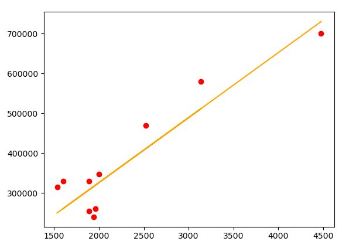

# linear Regression

##  Model for linear Regression using gradient descent from scratch, that works for uni and multi linear regression problems

> How to use ?
    1. import linear regression in your file as lr
    2. model = linearRegression
    
## Results
# Univariate:
### gave accuracy of 89%

# Multivariate:
### gave accuracy of 85.3%

